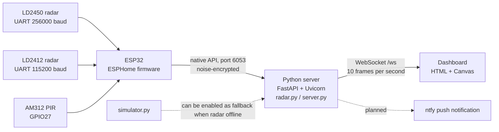
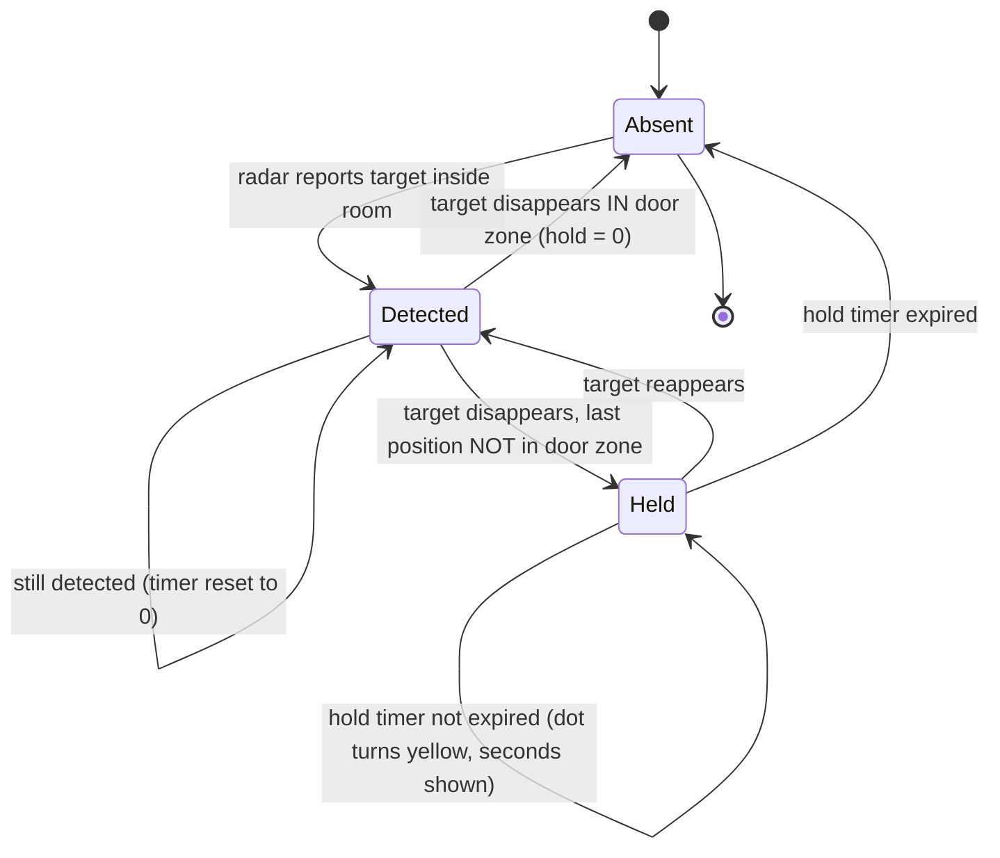
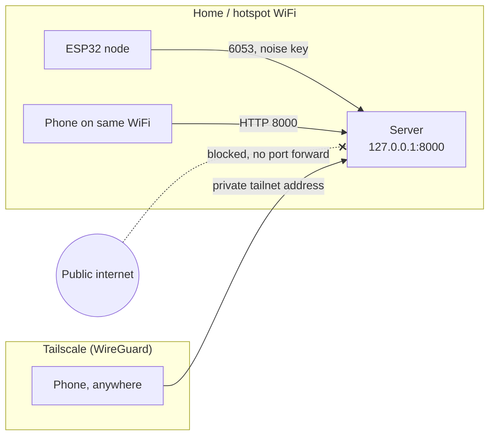

# WiFi Sense — Design

---

## 1. Design decisions at a glance

| #  | Decision                    | Choice                                                     | Requirement |
| -- | --------------------------- | ---------------------------------------------------------- | ----------- |
| D1 | Room coordinate system      | metres, origin in one room corner, x right, y down         | FR2         |
| D2 | Sensor mounting             | LD2450 on the x=0 wall, 2 m along it, facing into the room | FR2, FR5    |
| D3 | Transport node → server    | ESPHome native API (encrypted, port 6053)                  | FR2         |
| D4 | Transport server → browser | WebSocket, one JSON frame per 100 ms                       | FR2, FR4    |
| D5 | Persistence                 | none — everything in memory                               | privacy     |
| D6 | Still-person handling       | zone-dependent hold timer, not a fixed timeout             | FR3         |
| D7 | Out-of-room rejection       | rectangle test after coordinate transform                  | FR5         |
| D8 | Remote access               | Tailscale only, no port forwarding                         | FR7         |

D5 explained: nothing is written to disk. No database, no log of who was where. this is based on the privacy claim the whole project rests is based on, if no history exists, no history can leak.

---

## 2. System architecture



Three layers, each replaceable on its own: the firmware knows nothing about rooms, the server knows nothing about drawing, the dashboard knows nothing about radar hardware. The simulator plugs in at the same seam the radar does, which is why the whole product could be built before the parts arrived.

### Responsibility split

| Layer              | Does                                                                                                | Deliberately does not                   |
| ------------------ | --------------------------------------------------------------------------------------------------- | --------------------------------------- |
| ESP32 / ESPHome    | read both radars + PIR over UART, publish named entities, throttle to 10 Hz                         | interpret anything, know the room shape |
| `radar.py`       | hold the connection, map entity names to state, transform to room metres, reject out-of-room points | decide presence over time               |
| `server.py`      | hold timers, choose radar vs simulator, serve the dashboard, push frames                            | talk to hardware directly               |
| `dashboard.html` | draw the room, dots, zones, state text                                                              | any presence logic                      |

---

## 3. Room and coordinate design

Room is 5 m × 4 m. Origin is the top-left corner in the drawing, x runs right (0–5 m), y runs down (0–4 m). The dashboard uses 100 px per metre, so the canvas is exactly 500 × 400 px and no scaling math is needed while drawing.

```
 (0,0)                                       (5,0)
   +--------[ window zone ]---------------------+
   |         x 0.6–1.4                          |
   |         y 0.0–0.6                          |
   |                                            |
 S >  sensor at (0, 2), facing +x                |
   |                                            |
   |                          [ door zone ]     |
   |                           x 3.0–4.0        |
   |                           y 3.4–4.0        |
   +--------------------------------------------+
 (0,4)                                       (5,4)
```

The LD2450 reports positions in millimetres relative to itself. Transform:

```
room_x = (x_mm / 1000) + SENSOR_X     # SENSOR_X = 0.0
room_y = (y_mm / 1000) + SENSOR_Y     # SENSOR_Y = 2.0
```

A point counts as inside the room when `0 ≤ room_x ≤ 5` and `0 ≤ room_y ≤ 4`. Everything else is dropped before it ever reaches the presence logic — that is FR5, and it is what keeps the neighbour walking behind the wall off my map.

> **TODO** — the mounting height and tilt of the LD2450 are not fixed yet, and the module reports a flat plane. Decide whether the sensor sits at chest height (better torso reflection) or ceiling-corner (better coverage, worse left/right resolution), and re-measure the transform after mounting.

> **TODO** — the two zone rectangles were eyeballed from the room layout drawing. Measure them against the real door and window and write the corrected numbers here.

---

## 4. Data design

There is no database, so there is no ERD. What replaces it is the contract between the three layers: the ESPHome entity names, and the WebSocket frame.

### 4.1 ESPHome entities (node → server)

| Entity name          | Type        | Source          | Used for                            |
| -------------------- | ----------- | --------------- | ----------------------------------- |
| `Presence`         | binary      | LD2412          | coarse presence, radar status line  |
| `Moving target`    | binary      | LD2412          | status line                         |
| `Still target`     | binary      | LD2412          | still-person evidence (FR3)         |
| `Moving distance`  | number (cm) | LD2412          | status line                         |
| `Still distance`   | number (cm) | LD2412          | status line                         |
| `Target count`     | number      | LD2450          | sanity check against parsed targets |
| `T1 x` … `T3 x` | number (mm) | LD2450          | person position (FR2)               |
| `T1 y` … `T3 y` | number (mm) | LD2450          | person position (FR2)               |
| `PIR Motion`       | binary      | AM312 on GPIO27 | planned cross-check                 |

The `T{n} x/y` naming is what lets `radar.py` index a target by slicing the name rather than maintaining a lookup table. Positions are throttled to 100 ms on the node, so the network carries 10 updates per second per axis and no more.

### 4.2 WebSocket frame (server → dashboard)

One JSON object every 100 ms:

```json
{
  "source": "radar",
  "people": [
    { "x": 2.51, "y": 1.98, "held": false },
    { "x": 1.10, "y": 3.40, "held": true, "held_seconds": 12.4 }
  ],
  "radar": {
    "connected": true,
    "present": true,
    "moving": false,
    "still": true,
    "still_distance": 210.0
  }
}
```

| Field                     | Meaning                                                                                                  |
| ------------------------- | -------------------------------------------------------------------------------------------------------- |
| `source`                | `"radar"` or `"simulator"` — the dashboard shows this so a demo can never be mistaken for live data |
| `people[].x/y`          | room metres, 2 decimals                                                                                  |
| `people[].held`         | true = inferred from the hold timer, not currently detected                                              |
| `people[].held_seconds` | how long it has been inferred                                                                            |
| `radar.*`               | raw node state, for the status line and for debugging                                                    |

`held` exists so the UI can be honest about uncertainty. A held dot is a claim about the past ("someone was here and I have no evidence they left"), not a measurement, and it is drawn differently for exactly that reason.

### 4.3 Configuration

| Name                       | Value             | Where                            |
| -------------------------- | ----------------- | -------------------------------- |
| `SENSOR_X`, `SENSOR_Y` | 0.0, 2.0          | `radar.py`                     |
| room bounds                | 5 × 4 m          | `radar.py`, `dashboard.html` |
| `MAX_HOLD_FRAMES`        | 3000 (300 s)      | `server.py`                    |
| window hold                | 150 frames (15 s) | `server.py`                    |
| door hold                  | 0 frames          | `server.py`                    |
| frame interval             | 0.1 s             | `server.py`, firmware throttle |
| `SCALE`                  | 100 px/m          | `dashboard.html`               |

> **TODO** — these constants live in three files and must agree. Move them into one config file (room geometry, zones, timings) before the room layout changes again.

---

## 5. Presence state machine

Per tracked person:



Hold length depends on where the person was last seen:

| Last-seen zone                  | Hold  | Reasoning                                                                                  |
| ------------------------------- | ----- | ------------------------------------------------------------------------------------------ |
| Door (x 3.0–4.0, y 3.4–4.0)   | 0 s   | the one place a person can plausibly leave — drop immediately                             |
| Window (x 0.6–1.4, y 0.0–0.6) | 15 s  | leaving through a window is possible but unlikely; a short grace period                    |
| Anywhere else                   | 300 s | a person cannot vanish from the middle of a room, so this is a still person the radar lost |

300 s is a judgement call, not a measurement. Too short and someone reading on the bed disappears; too long and a false detection from a fan keeps the room "occupied" all evening, and each phantom person costs a tracking slot out of three. Five minutes is roughly the longest a person sits genuinely motionless without the radar catching a breath or a shift.

> **TODO** — the hold state is currently a single `last_x` / `last_y` pair, so it only works for one person. Design the multi-person version: a list of
> tracked people, each with its own timer, plus a rule for matching a new detection to an existing track (nearest-neighbour within a distance
> threshold, most likely) and what happens when the LD2450 swaps IDs.

> **TODO — sensor fusion.** Three sources (LD2450 positions, LD2412 still/moving, PIR motion) and no written rule for combining them. Decide:
> does LD2412 "still target" alone hold a person, and may PIR alone ever create one? Write the truth table here before implementing it.

---

## 6. Dashboard design

Single page, no framework, no build step. Layout as built:

```
+--------------------------------------------------+
|  WiFi Sense                                       |
|  Room state: 2 people                             |
|  +--------------------------------------------+  |
|  |  . . . . window . . . . . . . . . . . . .  |  |
|  |  .                                      .  |  |
|  |         (red dot)                          |  |
|  |                     (yellow dot)           |  |
|  |                     still 12.4 seconds     |  |
|  |  .                         [ door ]     .  |  |
|  +--------------------------------------------+  |
|  Position: 2.51, 1.98                             |
|  Status: live        Radar: sees someone still    |
|  Source: radar                                    |
+--------------------------------------------------+
```

| Element             | Design rule                                                             |
| ------------------- | ----------------------------------------------------------------------- |
| Grid                | 1 m lines, so a viewer can read a position off the map without the text |
| Door / window zones | tinted rectangles — makes the hold behaviour explainable during a demo |
| Detected person     | red dot                                                                 |
| Held person         | yellow dot + "still N seconds" label                                    |
| Room state text     | empty / 1 person / N people (FR4)                                       |
| Status line         | WebSocket state: connecting / live / disconnected                       |
| Radar line          | offline / sees no one / sees someone moving / sees someone still at N m |
| Source line         | radar or simulator                                                      |

Two colours carry the whole trust model: red means measured, yellow means inferred. Anyone watching the screen can tell the difference without being told.

> **TODO** — phone layout. The canvas is a fixed 500 × 400 px, which is wider than most phone screens (FR7). Decide between a CSS scale transform and
> redrawing at device width.

> **TODO** — arm/disarm control and the notification banner have no design yet.

---

## 7. Network and security design



| Rule                                   | Why                                                                          |
| -------------------------------------- | ---------------------------------------------------------------------------- |
| No port forwarding, ever               | a presence feed on the open internet tells a burglar when the house is empty |
| ESPHome API encrypted with a noise PSK | anyone on the WiFi could otherwise read the node                             |
| `firmware/secrets.yaml` git-ignored  | WiFi password, OTA password and API key never reach GitHub                   |
| Remote access only through Tailscale   | device-level auth, no service exposed to the internet                        |
| Nothing persisted                      | no history to steal                                                          |

> **TODO** — `use_address` in the firmware is hard-coded to a hotspot IP and commented/uncommented by hand when switching networks. Design a better
> approach (mDNS name, or a static lease).

---

## 8. Failure behaviour

| Failure                                 | Current design                                                                      | Status                           |
| --------------------------------------- | ----------------------------------------------------------------------------------- | -------------------------------- |
| Radar node offline                      | `radar.py` retries every 5 s; `connected` goes false; dashboard shows "offline" | built                            |
| Radar offline while server runs         | server falls back to the simulator and labels`source: simulator`                  | built                            |
| Browser loses WebSocket                 | status shows "disconnected"                                                         | built, no auto-reconnect         |
| Radar reports a target outside the room | dropped by`in_room()`                                                             | built                            |
| Notification fails to deliver           | —                                                                                  | **TODO**, see PRODUCT-FLOW |

> **TODO** — browser-side reconnect with a backoff. Right now a dropped socket means a manual refresh, which will look bad in a demo.

---

## 9. Traceability: requirement → design

| Req                    | Design element                                   |
| ---------------------- | ------------------------------------------------ |
| FR1 presence           | §5 state machine,`Presence` entity            |
| FR2 positions ≥5 Hz   | §3 transform, §4.2 frame at 10 Hz, §6 canvas  |
| FR3 still person       | §5 hold timers, LD2412 still target             |
| FR4 state text         | §6 room state line                              |
| FR5 out-of-room filter | §3`in_room()` bounds test                     |
| FR6 no camera/mic      | §2 — no such device exists in the architecture |
| FR7 remote + notify    | §7 Tailscale; notification **TODO**      |

---

## 10. Design artifacts in this repository

| File                                              | What it shows                          |
| ------------------------------------------------- | -------------------------------------- |
| `docs/RoomLayout.png` / `room-layout.drawio`  | room, sensor placement, zones          |
| `docs/SensorNodeWiring.png` / `wiring.drawio` | node wiring                            |
| `docs/BreadboardConnections.png`                | breadboard build                       |
| `docs/cads/wiring/wiring.kicad_sch`             | schematic                              |
| `docs/PRODUCT-FLOW.md` / `product-flow.html`  | intended vs implemented flow           |
| this file                                         | architecture, data, state, network, UI |

> **TODO** — a user journey diagram (arm → leave → intrusion → notification → open dashboard over Tailscale) and a hand-drawn wireframe of the phone
> layout. Both are listed as good portfolio evidence in the Design workshop and neither exists yet.
