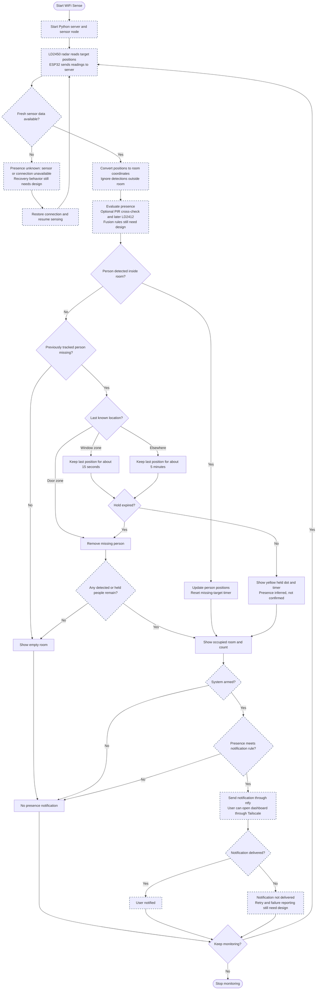
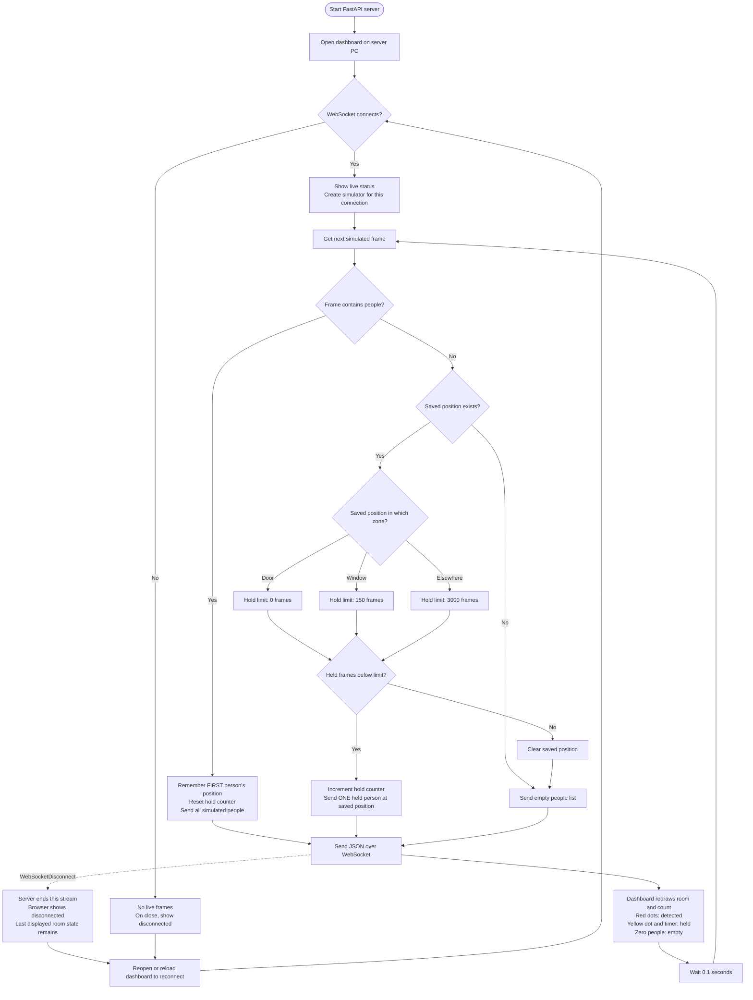
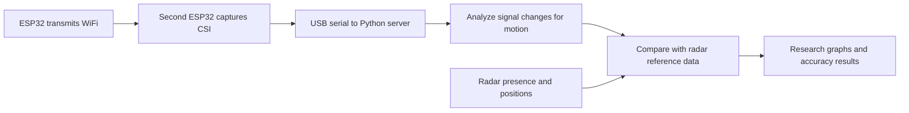

# WiFi Sense product flow

Based on the working tree on 17 September 2026, including uncommitted changes. The first chart describes the intended product. The second describes the code that exists now. Dashed boxes in the product chart indicate planned work; plain boxes show behavior already present in the simulator path.

## Intended product

Monitoring repeats until stopped. Empty, occupied, and notified are outcomes of one cycle, not the end of monitoring.

The notification rule is not implemented or fully specified. Decisions still needed include whether held presence can trigger an alert, what happens when arming an already occupied room, repeat-alert cooldown, and delivery retries. The chart identifies these decisions without claiming they already work. The same applies to connection recovery and combining sensor readings.

The hold durations above come from current code. Applying them independently to multiple people is future work. Removing a target means the software stops counting it; it does not prove the person left. No detection likewise does not prove the room is physically empty.

## Current implementation

- The simulator supplies two mirrored positions when visible, followed by empty frames to mimic a stationary person disappearing. It initially moves for 100 frames, disappears for 50, then repeats 10 visible frames and 50 empty frames.
- Hold timing is frame-based: approximately 15 seconds at the window and 5 minutes elsewhere at the intended 10 updates per second. Actual elapsed time can be longer. A new nonempty frame resets the hold.
- Only the first person's position is remembered. If some people disappear while another remains, no per-person hold runs. If everyone disappears, only one held dot remains.
- Each dashboard connection starts its own simulator and hold state. There is no shared room state yet.
- `/status` always returns zero people. `/api/state` always returns an unoccupied placeholder. Neither endpoint supplies the dashboard's live state.
- The dashboard connects to `ws://localhost:8000/ws`. Remote phone access needs changes. There is no automatic browser reconnection or stale-data timeout; after disconnect, old dots can remain visible.
- Firmware config exposes a PIR input on GPIO27 and configures WiFi, an encrypted ESPHome API, and a fallback hotspot. It does not configure either radar, and the Python server does not consume its readings.
- There are no notifications, arm/disarm controls, room-boundary filtering, or CSI processing in the current application.

## Research branch

Planned WiFi-CSI research is separate from the product's alert decisions:

No CSI code exists in the current application. Other roadmap items, such as automatic arming and Raspberry Pi hosting, do not yet add implemented outcomes. Speculative extensions in the introduction have no defined control flow.

## Sources

- [Server and hold decisions](../server.py)
- [Simulator](../simulator.py)
- [Dashboard rendering and connection handling](../dashboard.html)
- [Sensor firmware configuration](../firmware/sensor-node.yaml)
- [Product requirements](PROJECT-INTRO.md)
- [Product plan and notification choices](../ai-docs-research/PLAN.md)

Where documentation and code disagree, the current-implementation chart follows code. For example, the introduction refers to a `main.py` entry point that is not present, and older planning text describes a different hold-release rule.
